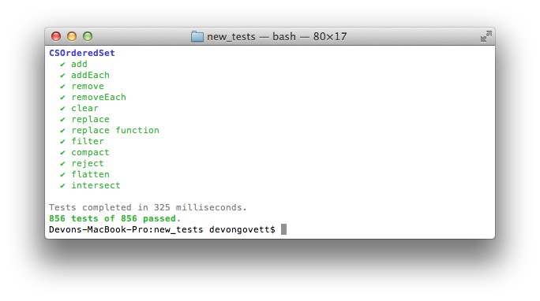

qunit-cli
=========

A Node module that adds colorful CLI support for the [QUnit](http://qunitjs.com/) testing framework.

## Usage

To use this module, first install it using npm

    npm install qunit-cli
    
Now, include it at the top of your test files.

    if (typeof QUnit == 'undefined') // if your tests also run in the browser...
        QUnit = require('qunit-cli');
        
    // use QUnit as you normally would.
    
Note that this module does not introduce QUnit into the global scope like QUnit does in the browser,
so you'll have to do that yourself if needed.

To run, use the `node` program.

    node mytests.js

## Command line options

There are several command line options available when running your tests using qunit-cli that mimic some of the
options in the standard browser-based QUnit testing interface.  They are:

    --module, -m    Limits testing to an individual module
    --test,   -t    Limits testing to a single test (by number)
    --quiet,  -q    Flag to hide passed tests from the output

## License

`qunit-cli` is released under the MIT license.